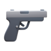

# <picture></picture> Seraphina Bot Lane Guide

## <picture></picture> Runes
	
### 🔑🪨 Keystone
1. <picture></picture> Arcane Comet
	- Default choice.
2. <picture></picture> Conqueror
	- vs 
		- 🛡️ Tanky comps, w/ ⏩🤝🏻 Long Trades
	- with
		- 🔻✨ Low Magic damage teams
3. </picture> First Strike
	- vs
		- 🛡️ Tanky comps, w/ 💣 AoE Value
	- with
		- 🔺✨ High Magic damage teams
4. </picture> Glacial Augment
	- vs
		- 🔻🛣️⚔️ Low Laning power
	- with
		- 🔻⛓️ Low CC, 🔺⚔️ High Damage teams

### <picture></picture> Primary

1. <picture></picture> Arcane Comet
	1. First Row
		- Manaflow Band (Default)
	
	2. Second Row
		- Transcendence (Default)
	
	3. Third Row
		- Scorch (Default)
		- Gathering Storm (If you don't need combat power in lane)

{
	- Presence of Mind (Default)
	
	- Legend: Haste (Default)
	
	- Cut Down (Default)
}
{
	- Cash Back (Default)
	
	- Triple Tonic (Default)
	
	- Jack of All Trades (Default)
}
{
	- Cash Back (Default)
	
	- Triple Tonic (Default)
	
	- Jack of All Trades (Default)
}
### <picture> Secondary
{
	- Legend: Haste (Default)
	- Coup de Grace (Default)

	- Cash Back (Default for Gathering Storm)
	- Triple Tonic (Default for Gathering Storm)
	- Cosmic Insight (If you really need your summoners up, swap with Cash Back)
}
{
	- Manaflow Band (Default)
	- Transcendence (Default)
	- Gathering Storm (vs Passive Lanes)
	
	- Triple Tonic (If you need to scale faster)
	- Jack of All Trades (If you need to scale faster)
}
{
	- Manaflow Band (Default)
	- Transcendence (Default)
	- Axiom Arcanist (If you will get a lot of ult value)
	- Gathering Storm (If you don't need combat power in lane, swap with First Row)
}
{
	- Manaflow Band (Default)
	- Transcendence (Default)
}

Shards
- Ability Haste (Default)

- Scaling Health (Default)

- Scaling Heath (Default)

	Spells
	
- Flash (Must)

- Teleport (Default)
- Barrier (vs Tanky Comps, or kill lanes)

	Items
	
Starting Item
- Doran's Ring (Default)
- Dark Seal (Always pick up early)

First Item
- Blackfire Torch [Arcane Comet, Conquerer, First Strike] (
- Luden's Echo (Arcane Comet, 
- Seraph's Embrace (Arcane Comet, Glacial Augment, 
- Imperial Mandate (Arcane Comet, First Strike, 
- Hextech Rocketbelt (Conquerer, 
- Malignance (Conquerer, 
- Shadowflame (Arcane Comet, 

Boots
- 

Second Item
- 

Third Item
- 

Fourth Item
- 

Fifth Item
- 

Sixth Item
- 