# 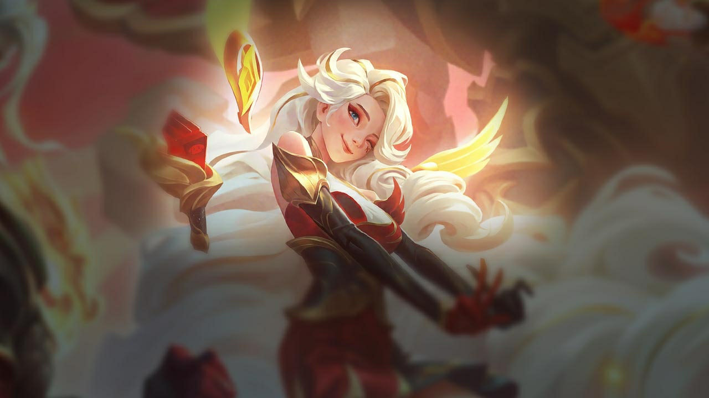   Seraphina Bot Lane Mage Guide

##  Runes
	
### 🔑🪨 <ins>**Keystone**</ins>
####  Glacial Augment
- Enemy
	- 🔻🛣️ Low Laning Power (You can just play to neutralize the lane.)
- Allies
	- 🔻⛓️ Low CC
	- 🔺⚔️ High Damage
- [Primaries](#-Glacial-Augment-1)
####  First Strike
- Enemy
	- 🛡️ Tanky
	- 💣 AoE Value
- Allies
	- 🔺✨ High Magic Damage
- [Primaries](#-First-Strike-1)
####  Conqueror
- Enemy
	- 🛡️ Tanky
	- ⏩🤝🏻 Long Trades
- Allies
	- 🔻✨ Low Magic Damage
- [Primaries](#-Conqueror-1)
####  Arcane Comet
- *Default*
- [Primaries](#-Arcane-Comet-1)

###  <ins>**Primary**</ins>

####  Arcane Comet
 
 
  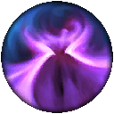&#9;|&#9; *Default*
 
 
  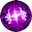
&nbsp;&nbsp;&nbsp;&nbsp;|&nbsp;&nbsp;&nbsp;&nbsp;
 *Default*	
 
 
  	
&nbsp;&nbsp;&nbsp;&nbsp;|&nbsp;&nbsp;&nbsp;&nbsp;
 *Default* **OR**  If you don't need combat power in lane.
 
 

####  Conqueror
 
 
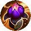  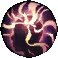
&nbsp;&nbsp;&nbsp;&nbsp;|&nbsp;&nbsp;&nbsp;&nbsp;
 *Default*
 
 
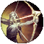  
&nbsp;&nbsp;&nbsp;&nbsp;|&nbsp;&nbsp;&nbsp;&nbsp;
 *Default*
 
 
 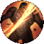 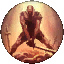
&nbsp;&nbsp;&nbsp;&nbsp;|&nbsp;&nbsp;&nbsp;&nbsp;
 *Default*
 
 

####  First Strike
 
 
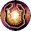 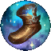 
&nbsp;&nbsp;&nbsp;&nbsp;|&nbsp;&nbsp;&nbsp;&nbsp;
 *Default*
 
 
 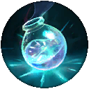 
&nbsp;&nbsp;&nbsp;&nbsp;|&nbsp;&nbsp;&nbsp;&nbsp;
 *Default*
 
 
  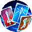
&nbsp;&nbsp;&nbsp;&nbsp;|&nbsp;&nbsp;&nbsp;&nbsp;
 *Default*
 
 

####	  Glacial Augment
 
 
  
&nbsp;&nbsp;&nbsp;&nbsp;|&nbsp;&nbsp;&nbsp;&nbsp;
 *Default*
 
 
  
&nbsp;&nbsp;&nbsp;&nbsp;|&nbsp;&nbsp;&nbsp;&nbsp;
 *Default*
 
 
  
&nbsp;&nbsp;&nbsp;&nbsp;|&nbsp;&nbsp;&nbsp;&nbsp;
 *Default*

###  <ins>**Secondary**</ins>

####  Arcane Comet
	 
	 
	  
	&nbsp;&nbsp;&nbsp;&nbsp;|&nbsp;&nbsp;&nbsp;&nbsp;
	 
	 
	  
	&nbsp;&nbsp;&nbsp;&nbsp;|&nbsp;&nbsp;&nbsp;&nbsp;
	 *Default*
	 
	 
	  
	&nbsp;&nbsp;&nbsp;&nbsp;|&nbsp;&nbsp;&nbsp;&nbsp;
	 *Default*
	 
	 
	**OR**
	 
	 
	  
	&nbsp;&nbsp;&nbsp;&nbsp;|&nbsp;&nbsp;&nbsp;&nbsp;
	 *Default if Gathering Storm*
	 
	 
	  
	&nbsp;&nbsp;&nbsp;&nbsp;|&nbsp;&nbsp;&nbsp;&nbsp;
	 *Default if Gathering Storm*
	 
	 
	  
	&nbsp;&nbsp;&nbsp;&nbsp;|&nbsp;&nbsp;&nbsp;&nbsp;
	 If you really need your summoners up, swap with Cash Back
	 
	 

####  Conqueror
	 
	 
	  
	&nbsp;&nbsp;&nbsp;&nbsp;|&nbsp;&nbsp;&nbsp;&nbsp;
	 *Default*
	 
	 
	  
	&nbsp;&nbsp;&nbsp;&nbsp;|&nbsp;&nbsp;&nbsp;&nbsp;
	 *Default*	
	 
	 
	  	
	&nbsp;&nbsp;&nbsp;&nbsp;|&nbsp;&nbsp;&nbsp;&nbsp;
	 vs Passive Lanes, swap with Manaflow Band
	 
	 
	**OR**
	 
	 
	  
	&nbsp;&nbsp;&nbsp;&nbsp;|&nbsp;&nbsp;&nbsp;&nbsp;
	 
	 
	  
	&nbsp;&nbsp;&nbsp;&nbsp;|&nbsp;&nbsp;&nbsp;&nbsp;
	 If you need to scale faster
	 
	 
	  
	&nbsp;&nbsp;&nbsp;&nbsp;|&nbsp;&nbsp;&nbsp;&nbsp;
	 If you need to scale faster
	 
	 

####  First Strike
	 
	 
	  
	&nbsp;&nbsp;&nbsp;&nbsp;|&nbsp;&nbsp;&nbsp;&nbsp;
	 *Default*
	 
	 
	  
	&nbsp;&nbsp;&nbsp;&nbsp;|&nbsp;&nbsp;&nbsp;&nbsp;
	 *Default*
	 
	 
	  
	&nbsp;&nbsp;&nbsp;&nbsp;|&nbsp;&nbsp;&nbsp;&nbsp;
	 *Default*
	 
	 

####  Glacial Augment
	 
	 
	  
	&nbsp;&nbsp;&nbsp;&nbsp;|&nbsp;&nbsp;&nbsp;&nbsp;
	 *Default*
	 
	 
	  
	&nbsp;&nbsp;&nbsp;&nbsp;|&nbsp;&nbsp;&nbsp;&nbsp;
	 *Default*
	 
	 
	  
	&nbsp;&nbsp;&nbsp;&nbsp;|&nbsp;&nbsp;&nbsp;&nbsp;
	 *Default*

{
	- Manaflow Band (Default)
	- Transcendence (Default)
	- Axiom Arcanist (If you will get a lot of ult value)
	- Gathering Storm (If you don't need combat power in lane, swap with First Row)
}
{
	- Manaflow Band (Default)
	- Transcendence (Default)
}

### **Shards** 

- Ability Haste (Default)

- Scaling Health (Default)

- Scaling Heath (Default)

	Spells
	
- Flash (Must)

- Teleport (Default)
- Barrier (vs Tanky Comps, or kill lanes)

	Items
	
Starting Item
- Doran's Ring (Default)
- Dark Seal (Always pick up early)

First Item
- Blackfire Torch [Arcane Comet, Conquerer, First Strike] (
- Luden's Echo (Arcane Comet, 
- Seraph's Embrace (Arcane Comet, Glacial Augment, 
- Imperial Mandate (Arcane Comet, First Strike, 
- Hextech Rocketbelt (Conquerer, 
- Malignance (Conquerer, 
- Shadowflame (Arcane Comet, 

Boots
- 

Second Item
- 

Third Item
- 

Fourth Item
- 

Fifth Item
- 

Sixth Item
- 