# 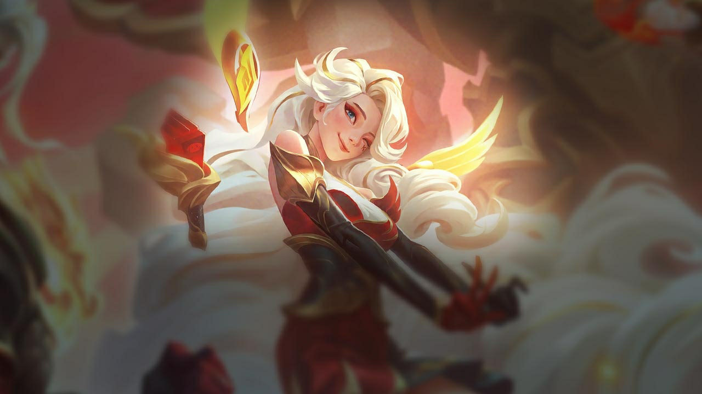 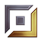  Seraphina Bot Lane Mage Guide

##  Runes
	

  
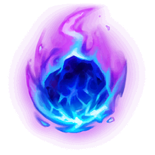 <ins><b>Keystone</b></ins>

#### 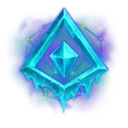 Glacial Augment
- Enemy
	- 🔻🛣️ Low Laning Power (You can just play to neutralize the lane.)
- Allies
	- 🔻⛓️ Low CC
	- 🔺⚔️ High Damage
- [Primaries](#-Glacial-Augment-1)
#### 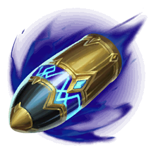 First Strike
- Enemy
	- 🛡️ Tanky
	- 💣 AoE Value
- Allies
	- 🔺✨ High Magic Damage
- [Primaries](#-First-Strike-1)
####  Conqueror
- Enemy
	- 🛡️ Tanky
	- ⏩🤝🏻 Long Trades
- Allies
	- 🔻✨ Low Magic Damage
- [Primaries](#-Conqueror-1)
####  Arcane Comet
- *Default*
- [Primaries](#-Arcane-Comet-1)

	
 <ins><b>Primary</b></ins>

####  Arcane Comet

<table>
  <tr>
    <td>
	  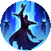  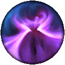
	</td>
	<td>
	   <em>Default</em>
	</td>
  </tr>
  <tr>
    <td>
	    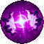
	</td>
    <td>
	   <em>Default</em>
	</td>
  </tr>
  <tr>
    <td>
	    
	</td>
    <td>
	   
	  <em>Default</em> <strong>OR</strong>  If you don't need combat power in lane.
	</td>
  </tr>
</table>

- [Secondaries](#-Arcane-Comet-2)

####  Conqueror

<table>
  <tr>
    <td>
	  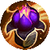  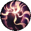
	</td>
    <td>
	   
	  <em>Default</em>
	</td>
  </tr>
  <tr>
    <td>
	  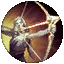  
	</td>
    <td>
	   
	  <em>Default</em>
	</td>
  </tr>
  <tr>
    <td>
	   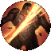 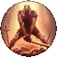
	</td>
    <td>
	   
	  <em>Default</em>
	</td>
  </tr>
</table>

- [Secondaries](#-Conqueror-2)

####  First Strike

<table>
  <tr>
    <td>
	    
	</td>
    <td>
	   
	  <em>Default</em>
	</td>
  </tr>
  <tr>
    <td> 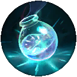 </td>
    <td> <em>Default</em></td>
  </tr>
  <tr>
    <td>  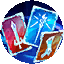</td>
    <td> <em>Default</em></td>
  </tr>
</table>

- [Secondaries](#-First-Strike-2)

####  Glacial Augment

<table>
  <tr>
    <td>
	    
	</td>
    <td>
	   
	  <em>Default</em>
	</td>
  </tr>
  <tr>
    <td>
	    
	</td>
    <td>
	   
	  <em>Default</em>
	</td>
  </tr>
  <tr>
    <td>
	    
	</td>
    <td>
	   
	  <em>Default</em>
	</td>
  </tr>
</table>

- [Secondaries](#-Glacial-Augment-2)

  
 <ins><b>Secondary</b></ins>

####  Arcane Comet
<table>
  <tr>
    <td>
        
    </td>
    <td>
    </td>
  </tr>
  <tr>
    <td>  </td>
    <td> <em>Default</em></td>
  </tr>
  <tr>
    <td>  </td>
    <td> <em>Default</em></td>
  </tr>
  <tr>
    <td align="center"><strong>OR</strong></td>
    <td></td>
  </tr>
  <tr>
    <td>  </td>
    <td> <em>Default if Gathering Storm</em></td>
  </tr>
  <tr>
    <td>  </td>
    <td> <em>Default if Gathering Storm</em></td>
  </tr>
  <tr>
    <td>  </td>
    <td> If you really need your summoners up, swap with Cash Back</td>
  </tr>
</table>

####  Conqueror
<table>
  <tr>
    <td>  </td>
    <td> <em>Default</em></td>
  </tr>
  <tr>
    <td>  </td>
    <td> <em>Default</em></td>
  </tr>
  <tr>
    <td>  </td>
    <td> vs Passive Lanes, swap with Manaflow Band</td>
  </tr>
  <tr>
    <td><strong>OR</strong></td>
    <td></td>
  </tr>
  <tr>
    <td>  </td>
    <td></td>
  </tr>
  <tr>
    <td>  </td>
    <td> If you need to scale faster</td>
  </tr>
  <tr>
    <td>  </td>
    <td> If you need to scale faster</td>
  </tr>
</table>

####  First Strike
<table>
  <tr>
    <td>  </td>
    <td> <em>Default</em> <b>OR</b>  If you will get a lot of ult value</td>
  </tr>
  <tr>
    <td>  </td>
    <td> <em>Default</em></td>
  </tr>
  <tr>
    <td>  </td>
    <td> If you don't need combat power in lane, swap with First Row</td>
  </tr>
</table>

####  Glacial Augment
<table>
  <tr>
    <td>  </td>
    <td> <em>Default</em></td>
  </tr>
  <tr>
    <td>  </td>
    <td> <em>Default</em></td>
  </tr>
  <tr>
    <td>  </td>
    <td></td>
  </tr>
</table>

  
 <ins><b>Shards</b></ins>

  #### <!-- Header as a space between the Summary and the table -->
  <table>
    <tr>
      <td>  </td>
      <td> <em>Default</em></td>
    </tr>
    <tr>
      <td>  </td>
      <td> <em>Default</em></td>
    </tr>
    <tr>
      <td>  </td>
      <td> <em>Default</em></td>
    </tr>
  </table>

  
 <ins><b>Spells</b></ins>

#### <!-- Header as a space between the Summary and the table -->
- 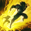 Flash - <em>Must</em>
- 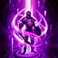 Teleport - <em>Default</em>
  -  Barrier - vs 🛡️ Tanky comps, or 🔪 Kill lanes

  
 <ins><b>Items</b></ins>

####  Starting Items

-  - *Default*
- 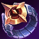 - Always pick up early.

####  First Item

- 
  - 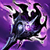 - *Default* (Arcane Comet, Conquerer, First Strike)
  - 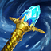 - If your jungle & support have no gank setup between them. Pick up a tear early for either Seraph's or Diadem. (Arcane Comet, Glacial Augment)
- 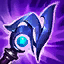 - (Arcane Comet)
- 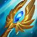 - (Arcane Comet, Glacial Augment)
- 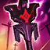 - (Arcane Comet, First Strike)
- 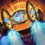 - (Conquerer)
- 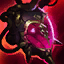 - (Conquerer)
- 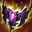 - (Arcane Comet)

First Item
- Blackfire Torch [Arcane Comet, Conquerer, First Strike] (
- Luden's Echo (Arcane Comet, 
- Seraph's Embrace (Arcane Comet, Glacial Augment, 
- Imperial Mandate (Arcane Comet, First Strike, 
- Hextech Rocketbelt (Conquerer, 
- Malignance (Conquerer, 
- Shadowflame (Arcane Comet, 
- Rylai's Crystal Scepter (Arcane Comet, Glacial Augment,

Boots
- 

Second Item
- 

Third Item
- 

Fourth Item
- 

Fifth Item
- 

Sixth Item
- 